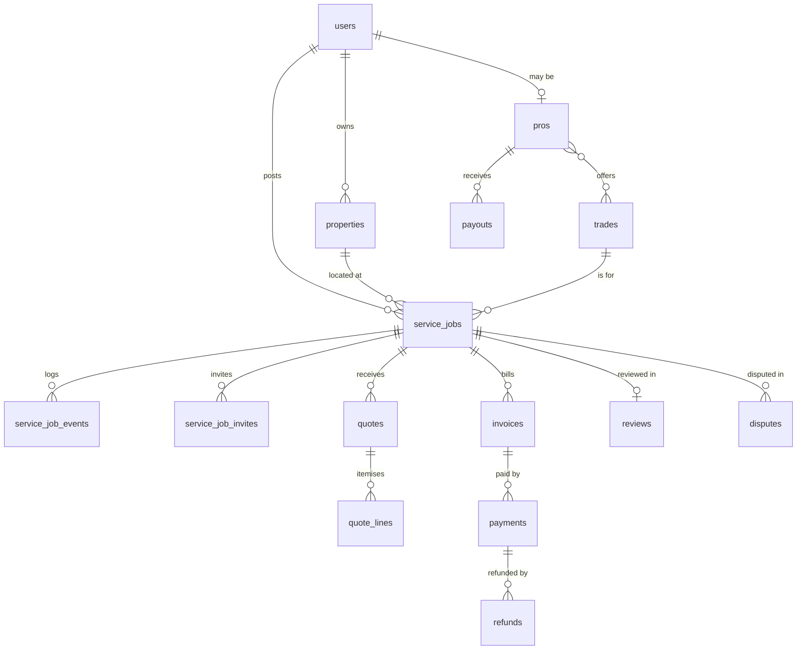

# Data model (v1)

Postgres 17+ with PostGIS. This is the target shape; migrations are the source of truth once written, and this file must be updated in the same change as any migration that alters it.

## Conventions

- PostGIS is enabled by migration `2026_10_03_000000_enable_postgis_extension`. Framework tables in place: `sessions`, `cache`, `cache_locks`, `jobs`, `job_batches`, `failed_jobs`.

- Primary keys: `bigint` identity (`id`) for joins. Every table exposed in a URL also has a `public_id` **ULID** (unique). **Never put `id` in a URL or API response.**
- Money: `*_cents bigint not null`, currency fixed to ZAR (column `currency char(3) default 'ZAR'` only where amounts can be shown to users).
- Time: `timestamptz` (absolute instants); the app and the database connection both run on `Africa/Johannesburg` (decision 052).
- Flexible answers: `jsonb` (scoping answers, flags). Validate shape in code before writing.
- Soft deletes only where noted. Money, events and audit rows are **never** deleted or updated after the fact (append-only).
- Encrypted columns (Laravel `encrypted` cast): ID numbers, bank account numbers, registration numbers. Store a separate keyed hash if lookup is needed.
- Foreign keys always declared with explicit `on delete` behaviour (`restrict` by default).

## Tables

### Identity and consent
| Table | Key columns |
|---|---|
| `users` | public_id, first_name, last_name, phone_e164 (unique), phone_verified_at, email (nullable, unique), password (nullable; customers and pros who sign up by email, and admins), google_id (nullable, unique; spec 014), email_verified_at, app_authentication_secret + app_authentication_recovery_codes (encrypted, hidden; admin MFA), locale, notification_preferences (jsonb, nullable: message groups and WhatsApp/SMS choice; spec 021), pending_email (nullable: a new address waiting for its emailed link; spec 021), deleted_at — **in place** (migration `2026_10_03_000007`; spec 021 columns `2026_10_07_090000`) |
| `consents` | user_id (restrict on delete), type (terms/privacy/marketing/pro_agreement), version, granted_at, withdrawn_at, ip, user_agent — **in place** |
| Roles & permissions | `spatie/laravel-permission` tables. Roles: `customer`, `pro`, `admin_super`, `admin_support`, `admin_vetting`, `admin_finance` — **in place**; created by migration `2026_10_03_000003_create_default_roles`, mirrored by `App\Domain\Accounts\Enums\Role` |

### Places
| Table | Key columns |
|---|---|
| `properties` | public_id, user_id, label, street_address (encrypted, hidden), area_label (approximate area from Places, safe to show pros), location (geography Point from the picked Places address), location_source (places), google_place_id, postal_code, property_type (house/flat/townhouse/business/other), deleted_at — **in place**; suburb_id removed in spec 020 |
| `geocoder_usage` | purpose (autocomplete/resolve), outcome (ok/error/throttled), latency_ms, created_at; no address text; pruned after 90 days (spec 015) — **in place** |
| `waitlist_entries` | first_name, phone_e164, trade_id, area_label, location (geography Point), privacy_version, consented_at, timestamps; unique phone + trade + area; pruned after 12 months — **in place** (spec 006; reworked in spec 020) |

### Catalogue (seeded from `docs/product/scoping/*.yaml`)
| Table | Key columns |
|---|---|
| `trades` | key (unique; URL key), name, status (demo/live), is_active, sort — **in place** |

Enums: `TradeStatus`, `QuestionType`, `RegistrationType` (`App\Domain\Catalogue\Enums`). Keys never change. Permissions `catalogue.view` (all admin roles) and `catalogue.edit` (super, support).

### Pros
| Table | Key columns |
|---|---|
| `introductions` | public_id, service_job_id (unique), quote_id, pro_id, customer_id, kind (free/credit), fee_cents, created_at — append-only; written when a client chooses a pro (spec 023) — **in place** |
| `credit_purchases` | public_id, pro_id, amount_cents, status (pending/complete/failed), provider_reference (PayFast payment id), completed_at — changes only from a verified PayFast notification — **in place** |
| `pro_credit_entries` | pro_id, type (purchase/introduction/adjustment), amount_cents (signed), credit_purchase_id, introduction_id, note, idempotency_key (unique), created_at — append-only ledger; balance is the sum — **in place** |
| `pros` | base_location (geography Point, the pro's Places address), base_address (encrypted), base_place_id, base_area_label (safe to show customers), service_radius_km (default 15; spec 020), public_id, user_id (unique), status (draft/submitted/changes_requested/approved/rejected/suspended — only `ProStatusMachine` changes it), business_name (nullable until the business step), business_type (sole_trader/company), vat_number, bio, weekly_job_cap, vetting_consent_at, submitted_at, decided_by, decided_at, decision_reason (shown to the pro), approved_at, suspended_at, reapply_after, last_activity_at, contact_masking_count (quotes with masked contact details; flagged at 3, spec 010) — **in place** (spec 006 + `2026_10_04_130000`, spec 008); base_location, ratings and response metrics are deferred; paused_at (nullable timestamp: the pro paused new invites, spec 021) |
| `pro_trades` | pro_id, trade_id (unique pair) — **in place** (spec 020, `2026_10_07_000001`) |
| `pro_documents` | public_id (ULID, used in signed URLs), pro_id, type (id_document/proof_of_address/profile_photo/pirb/electrical_registered_person; unique per pro), status (pending/verified/flagged), number (encrypted; registrations), one private media file, verified_at, verified_by, expires_at, flag_message (shown to the pro until resubmission), notes (private to vetting) — **in place** (spec 008) |
| `pro_job_allocations` | pro_id, service_job_id (unique pair), allocated_at — rolling weekly cap input, in place (spec 006); accepted jobs will write records in spec 010 |
| `pro_customer_exclusions` | pro_id + customer_id (unique pair), service_job_id, upheld_at — upheld dispute exclusion, in place (spec 006); dispute workflow will write records later |
| `pro_references` | pro_id, name, phone_e164 (encrypted), relationship, outcome (pending/positive/negative/no_answer), note (private), checked_by, checked_at — **in place** (spec 008) |
| `pro_events` | pro_id, from_status, to_status, actor_id, reason, created_at — append-only status history; the retention prune blanks `reason` (spec 008, decision 034) — **in place** |
| `pro_bank_accounts` | pro_id, bank_name, account_holder, account_number (encrypted), branch_code, provider_recipient_ref, verified_at |
| `pro_strikes` | pro_id, type, service_job_id, notes, created_by |

### Jobs
| Table | Key columns |
|---|---|
| `service_jobs` | public_id, customer_id, property_id, trade_id, facts jsonb (`[{id, text, turn}]` extracted by Siya, highlighted for pros), location (geography Point copied from the property when posted), area_label, status, urgency (normal/urgent), preferred_date, time_window (morning/afternoon/flexible/today), customer_notes, ai_summary (≤ 600 chars), ai_summary_source (ai/customer_edited/none), ai_summary_generated_at, ai_summary_input_hash (sha256 of trade + facts + notes the description was written for), posted_at, quote_window_ends_at, cancelled_at, cancel_reason, last_wave_at, matching_stopped_at, matching_stopped_reason, quotes_count (current submitted quotes, max `matching.max_quotes`, default 5), accepted_quote_id, scheduled_for (date from the accepted quote) — **in place** (`2026_10_04_000004`; summary provenance `2026_10_04_120000`, spec 007; matching fields `2026_10_04_140000`, spec 009; quote fields `2026_10_04_150000`, spec 010). Later lifecycle fields (started/completed, cancelled_by) arrive with their specs. |
| `service_job_events` | service_job_id, from_status, to_status, event_type, actor_type, actor_id, payload jsonb, created_at (append-only; model refuses updates/deletes) — **in place** |

Settings: `job_timers.quote_window_hours` (72), `job_timers.draft_expiry_days` (7) via `App\Settings\JobTimers`.
| `service_job_invites` | public_id, service_job_id, pro_id, wave, status, invited_at, viewed_at, responded_at, expires_at, decline_reason, decline_note, invited_by (nullable admin); unique job+pro; indexed by status+expiry and pro+invited_at — **in place** (spec 009) |
| `quotes` | public_id, service_job_id, pro_id, version (unique per job + pro), status (submitted/accepted/declined/withdrawn/expired/superseded), labour_cents, materials_cents, callout_cents, vat_cents, total_cents, high_total_cents (optional top of an estimate range, spec 023), deposit_percent, deposit_cents (all server-calculated, integer cents), earliest_start_date, valid_until, notes (contact details masked), submitted_at, accepted_at, withdrawn_at, withdraw_reason, supersedes_quote_id — **in place** (spec 010) |
| `quote_lines` | quote_id, kind (labour/materials/callout), description (≤ 120, masked), quantity (decimal 10,2), unit_price_cents, line_total_cents (rounded half-up once per line), sort — **in place** (spec 010) |
| `job_conversations` | public_id, service_job_id, pro_id (unique job + pro), status (open/closed — only an admin closes; read-only after another pro is chosen is worked out from the job), closed_reason, closed_at, last_message_at, customer_read_at, pro_read_at, customer_notified_at, pro_notified_at — **in place** (spec 018, `2026_10_06_090000`) |
| `data_requests` | public_id, user_id, type (download/deletion), status (open/done), handled_by (nullable), handled_at, timestamps — a customer's request for a copy of their data or for account deletion, fulfilled by hand by support or super admins; nothing runs automatically — **in place** (spec 021, `2026_10_07_090000`) |
| `push_subscriptions` | subscribable (users, polymorphic), endpoint (unique, up to 1024), public_key, auth_token, content_encoding, timestamps — one row per browser or phone that turned on pop-up notifications; credentials, never logged or shown; removed when the device signs out, when the push service says it is gone, and when the account is deleted — **in place** (spec 022, package migrations `2026_10_07_043738`) |
| `pro_change_requests` | public_id, pro_id, trade_id (nullable), document_type (nullable), registration_number (encrypted, nullable), status (pending/approved/rejected), decision_reason, decided_by, decided_at, timestamps; the proposed registration file is private media — a trade or registration badge an approved pro asked to add or renew, applied only when a vetting or super admin approves it (spec 021, AC27) — **in place** (`2026_10_07_110000`) |
| `job_messages` | public_id, job_conversation_id, sender_type (customer/pro/system), sender_id, body (≤ 1000; contact and bank details masked until this pro's quote is accepted), kind (text/photos/quote_card), quote_id, deleted_at (sender, within 5 minutes; body cleared), reported_at, report_reason, reported_by; photos in media collection `message_photos` (WebP, private disk, signed 5-minute links); pruned 24 months after the job ends — **in place** (spec 018) |

### Money
| Table | Key columns |
|---|---|
| `invoices` | public_id, service_job_id, quote_id, pro_id, type (deposit/final), number (unique per pro), status, labour_cents, materials_cents, vat_cents, total_cents, issued_at, due_at, paid_at |
| `payments` | public_id, invoice_id, provider, provider_reference (unique), method, status, amount_cents, provider_fee_cents, idempotency_key (unique), succeeded_at, failed_reason |
| `refunds` | payment_id, amount_cents, reason, status, requested_by, approved_by, provider_reference |
| `payouts` | public_id, pro_id, service_job_id, gross_cents, commission_cents, net_cents, status, scheduled_for, paid_at, hold_reason, provider_reference, idempotency_key (unique) |
| `ledger_entries` | service_job_id, account, direction, amount_cents, source_type, source_id, idempotency_key, occurred_at (append-only) |
| `webhook_events` | provider, provider_event_id (unique per provider), type, signature_valid, payload jsonb, received_at, processed_at, error |

### Trust
| Table | Key columns |
|---|---|
| `reviews` | service_job_id (unique), customer_id, pro_id, rating (1–5), body, status (published/hidden), pro_reply, pro_replied_at |
| `disputes` | public_id, service_job_id, raised_by_type/id, reason, description, status, resolution (refund_full/refund_partial/rework/release), refund_cents, resolution_notes, resolved_by, resolved_at |

### Platform
| Table | Key columns |
|---|---|
| `media` | `spatie/laravel-medialibrary` on private `media` disk. `job_photos` collection belongs to `ServiceJob`; up to 5 processed WebP images per job, source metadata stripped, SHA-256 custom property for repeat upload detection. Cancelled drafts delete their photos. Pro documents and invoice PDFs use later collections. |
| `activity_log` | `spatie/laravel-activitylog` — admin and sensitive actions; append-only, never cleaned — **in place** |
| `settings` | `spatie/laravel-settings` — timers, commission, deposit cap — **table in place**; settings classes arrive with their features (`job_timers`; `ai`: enabled, suggestion_min_confidence, daily_call_budget, usage_retention_days — spec 007; `vetting`: reapply_after_days, retention_months — spec 008; `matching` — spec 009; `quotes`: max_deposit_percent, default_validity_days, max_total_cents and `money`: commission_percent, vat_percent — spec 010) |
| `ai_usage` | purpose (chat/summarise; suggest_service retired), provider, model, input_tokens, output_tokens, latency_ms, outcome (ok/invalid/timeout/error/throttled), service_job_id (nullable, null on delete), created_at; index (created_at, purpose). **No customer text and no user ID.** Pruned after `ai.usage_retention_days` (default 90) — **in place** (spec 007) |
| `notifications` | Laravel database notifications |
| Queue/cache/session | Laravel defaults on Postgres (`jobs`, `failed_jobs`, `cache`, `sessions`) |

## Key indexes and constraints

- `service_jobs (status, quote_window_ends_at)` for the scheduler.
- `service_job_invites (pro_id, status)` for the pro inbox.
- GiST indexes on all geography columns.
- Check constraints: `rating between 1 and 5`; all `*_cents >= 0`; `quotes.total_cents = labour + materials + callout + vat`.
- Partial unique index: one `accepted` quote per job.

## Siya conversation state (specs 019, 020)

Spec 020 replaces the model below: the session holds a `BookingState` (trade key, facts with ids, urgency, parked jobs, turn counter) alongside the transcript. There are no scoping answers or pending question keys. Facts are validated by `BookingToolbox` and copied to the draft job's `facts`. The text below describes the earlier design and is kept for history.

No new tables. Ordinary conversation, unsupported work and product questions do not apply service, answer or note proposals. The visible progress mapping has been removed; internal stages still guard booking controls. The existing booking session stores a pending question key, retry flag and stage before an emergency pause alongside the transcript and booking fields. Only customer job facts are copied to draft notes; product questions and off-topic exchanges stay in the session. Note excerpts proposed by the model must occur verbatim in scrubbed customer context.

A customer correction can change the service on the same policy-authorised `service_jobs` draft. Its incompatible answers are dropped, coverage is rechecked, unsupported urgent windows are cleared and a service change clears prior AI summary metadata. Property, valid schedule and existing photos are retained where applicable. The existing draft ownership, retention and explicit posting rules continue to apply.

Model requests contain scrubbed conversation/job facts, active catalogue questions, validated answers, a pending question and a non-personal booking stage. Private property/location cards and account identifiers are excluded. Usage rows remain metadata only.
