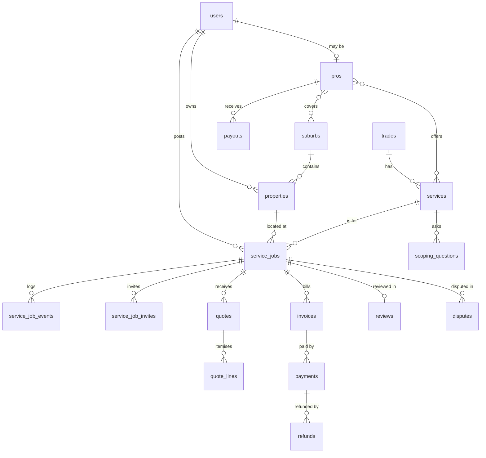

# Data model (v1)

Postgres 17+ with PostGIS. This is the target shape; migrations are the source of truth once written, and this file must be updated in the same change as any migration that alters it.

## Conventions

- PostGIS is enabled by migration `2026_10_03_000000_enable_postgis_extension`. Framework tables in place: `sessions`, `cache`, `cache_locks`, `jobs`, `job_batches`, `failed_jobs`.

- Primary keys: `bigint` identity (`id`) for joins. Every table exposed in a URL also has a `public_id` **ULID** (unique). **Never put `id` in a URL or API response.**
- Money: `*_cents bigint not null`, currency fixed to ZAR (column `currency char(3) default 'ZAR'` only where amounts can be shown to users).
- Time: `timestamptz`, stored UTC, shown in `Africa/Johannesburg`.
- Flexible answers: `jsonb` (scoping answers, flags). Validate shape in code before writing.
- Soft deletes only where noted. Money, events and audit rows are **never** deleted or updated after the fact (append-only).
- Encrypted columns (Laravel `encrypted` cast): ID numbers, bank account numbers, registration numbers. Store a separate keyed hash if lookup is needed.
- Foreign keys always declared with explicit `on delete` behaviour (`restrict` by default).

## Tables

### Identity and consent
| Table | Key columns |
|---|---|
| `users` | public_id, first_name, last_name, phone_e164 (unique), phone_verified_at, email (nullable, unique), password (nullable; admins only), app_authentication_secret + app_authentication_recovery_codes (encrypted, hidden; admin MFA), locale, deleted_at — **in place** (migration `2026_10_03_000007`) |
| `phone_otps` | phone_e164, code_hash (HMAC-SHA256 with app key), channel (whatsapp/sms), purpose, expires_at, attempts, consumed_at, ip — **in place**; pruned daily after 90 days |
| `consents` | user_id (restrict on delete), type (terms/privacy/marketing/pro_agreement), version, granted_at, withdrawn_at, ip, user_agent — **in place** |
| Roles & permissions | `spatie/laravel-permission` tables. Roles: `customer`, `pro`, `admin_super`, `admin_support`, `admin_vetting`, `admin_finance` — **in place**; created by migration `2026_10_03_000003_create_default_roles`, mirrored by `App\Domain\Accounts\Enums\Role` |

### Places
| Table | Key columns |
|---|---|
| `suburbs` | name, region, municipality, centroid (geography Point 4326), boundary (geography MultiPolygon, nullable), is_active |
| `properties` | public_id, user_id, label, street_address (encrypted), suburb_id, location (geography Point), postal_code, property_type, deleted_at |
| `waitlist_entries` | phone_e164, first_name, suburb_text, service_id, created_at |

### Catalogue (seeded from `docs/product/scoping/*.yaml`)
| Table | Key columns |
|---|---|
| `trades` | key (unique), name, status, sort |
| `services` | trade_id, key (unique within trade), name, description, requires_registration, emergency_capable, is_active, sort |
| `scoping_questions` | service_id, key, prompt, type, options jsonb, required, flags jsonb, sort |

### Pros
| Table | Key columns |
|---|---|
| `pros` | public_id, user_id (unique), business_name, vat_number, status (applied/in_review/approved/paused/suspended/rejected), bio, base_location (Point), weekly_job_cap, rating_avg, rating_count, response_rate, median_response_minutes, approved_at |
| `pro_services` | pro_id, service_id (unique pair) |
| `pro_service_areas` | pro_id, suburb_id (unique pair) |
| `pro_documents` | pro_id, type (id/pirb/electrical_registration/proof_of_address/reference/insurance), number (encrypted), status, verified_by, verified_at, expires_at, rejection_reason; file via media library |
| `pro_bank_accounts` | pro_id, bank_name, account_holder, account_number (encrypted), branch_code, provider_recipient_ref, verified_at |
| `pro_strikes` | pro_id, type, service_job_id, notes, created_by |

### Jobs
| Table | Key columns |
|---|---|
| `service_jobs` | public_id, customer_id, property_id, service_id, status, urgency (normal/urgent), preferred_date, time_window, scoping_answers jsonb, customer_notes, ai_summary, quotes_count, accepted_quote_id, posted_at, quote_window_ends_at, scheduled_for, started_at, completed_at, cancelled_at, cancelled_by_type/id, cancel_reason |
| `service_job_events` | service_job_id, from_status, to_status, event_type, actor_type, actor_id, payload jsonb, created_at (append-only) |
| `service_job_invites` | service_job_id, pro_id, wave, status, invited_at, viewed_at, responded_at, expires_at, decline_reason (unique job+pro) |
| `quotes` | public_id, service_job_id, pro_id, version, status, labour_cents, materials_cents, callout_cents, vat_cents, total_cents, deposit_cents, earliest_start_date, valid_until, notes, submitted_at, accepted_at, supersedes_quote_id |
| `quote_lines` | quote_id, kind (labour/materials/callout), description, quantity (decimal 10,2), unit_price_cents, line_total_cents, sort |

### Money
| Table | Key columns |
|---|---|
| `invoices` | public_id, service_job_id, quote_id, pro_id, type (deposit/final), number (unique per pro), status, labour_cents, materials_cents, vat_cents, total_cents, issued_at, due_at, paid_at |
| `payments` | public_id, invoice_id, provider, provider_reference (unique), method, status, amount_cents, provider_fee_cents, idempotency_key (unique), succeeded_at, failed_reason |
| `refunds` | payment_id, amount_cents, reason, status, requested_by, approved_by, provider_reference |
| `payouts` | public_id, pro_id, service_job_id, gross_cents, commission_cents, net_cents, status, scheduled_for, paid_at, hold_reason, provider_reference, idempotency_key (unique) |
| `ledger_entries` | service_job_id, account, direction, amount_cents, source_type, source_id, idempotency_key, occurred_at (append-only) |
| `webhook_events` | provider, provider_event_id (unique per provider), type, signature_valid, payload jsonb, received_at, processed_at, error |

### Trust
| Table | Key columns |
|---|---|
| `reviews` | service_job_id (unique), customer_id, pro_id, rating (1–5), body, status (published/hidden), pro_reply, pro_replied_at |
| `disputes` | public_id, service_job_id, raised_by_type/id, reason, description, status, resolution (refund_full/refund_partial/rework/release), refund_cents, resolution_notes, resolved_by, resolved_at |

### Platform
| Table | Key columns |
|---|---|
| `media` | `spatie/laravel-medialibrary` (job photos, pro documents, invoice PDFs) — private `media` disk — **in place** |
| `activity_log` | `spatie/laravel-activitylog` — admin and sensitive actions; append-only, never cleaned — **in place** |
| `settings` | `spatie/laravel-settings` — timers, commission, deposit cap — **table in place**; settings classes arrive with their features |
| `ai_interactions` | user_id, service_job_id, purpose, model, input_tokens, output_tokens, latency_ms, outcome (no raw customer text kept beyond 30 days) |
| `notifications` | Laravel database notifications |
| Queue/cache/session | Laravel defaults on Postgres (`jobs`, `failed_jobs`, `cache`, `sessions`) |

## Key indexes and constraints

- `service_jobs (status, quote_window_ends_at)` for the scheduler.
- `service_job_invites (pro_id, status)` for the pro inbox.
- GiST indexes on all geography columns.
- Check constraints: `rating between 1 and 5`; all `*_cents >= 0`; `quotes.total_cents = labour + materials + callout + vat`.
- Partial unique index: one `accepted` quote per job.
