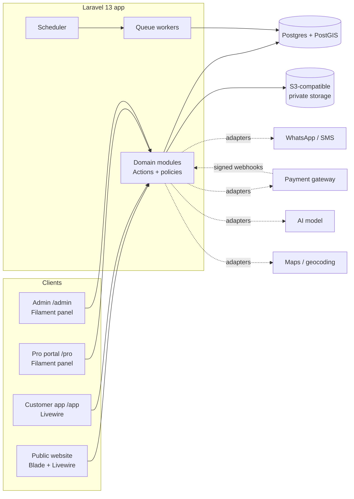

# Architecture overview

**Shape:** one Laravel application (a *modular monolith*) on Postgres, serving four surfaces, with background workers for slow or timed work. Third-party services sit behind interfaces so any provider can be swapped.



## Surfaces

| Surface | Path | Built with | Auth |
|---|---|---|---|
| Public website | `/`, `/plumbers/{suburb}`, `/how-it-works`, `/join` | Blade + Livewire, Tailwind | None |
| Customer app | `/app/*` | Livewire 4 components | Phone + OTP, role `customer` |
| Pro portal | `/pro/*` | Filament 5 panel `pro` | Phone + OTP, role `pro`, approved |
| Admin | `/admin/*` | Filament 5 panel `admin` | Email + password + MFA, admin roles |
| Webhooks | `/webhooks/{provider}` | Controllers | Provider signature only |
| Health | `/up` | Laravel health route | None |

A JSON API (`/api/v1`, Sanctum tokens) is **not built in v1**. Business logic lives in Actions so a native app can call the same code later.

## Code layout

```
app/
  Domain/                 # business logic, one folder per module
    Accounts/             # OTP login, consents
    Catalogue/            # trades, services, scoping
    Properties/
    ServiceJobs/          # state machine, transitions, timeline
    Matching/             # eligibility, ranking, invites
    Quotes/
    Payments/             # invoices, payments, refunds, ledger, payouts
    Reviews/
    Disputes/
    Pros/                 # onboarding, vetting, documents
    Assistant/            # AI scoping assistant
      each module: Actions/, Enums/, Data/, Events/, Exceptions/, Queries/
  Contracts/              # interfaces: PaymentGateway, MessagingChannel, ScopingAssistant, Geocoder
  Integrations/           # one folder per provider implementing a contract (+ Fake* for tests/dev)
  Filament/Admin/         # admin panel resources, pages, widgets
  Filament/Pro/           # pro panel resources, pages, widgets
  Livewire/               # customer + public components
  Http/Controllers/       # thin: webhooks, redirects, downloads
  Jobs/                   # queued jobs (thin: call an Action)
  Models/                 # Eloquent models (no business logic beyond relations, casts, scopes)
  Policies/               # one policy per model; every Filament resource and Livewire action authorises
  Notifications/          # WhatsApp/email/database notifications
```

### Rules of the layout

- **Controllers, Livewire components, Filament resources and queued jobs are thin.** They validate input, authorise, then call one Action.
- **Actions** are single-purpose classes (`AcceptQuote::run($quote, $customer)`), run inside a DB transaction when they write, and are the only place business rules live.
- **Models** hold relations, casts and query scopes only.
- **Modules talk through Actions, Queries and Events**, not by reaching into each other's tables.
- **Third parties are only called from `Integrations/`**, through a contract. Every contract has a `Fake` implementation used in tests and local dev.

## Background work

- Queue driver: `database` (Postgres) in v1 — one less moving part. Move to Redis + Horizon when queue volume justifies it (decision log).
- Queues: `default`, `notifications`, `payments` (payments isolated so a WhatsApp backlog never delays money).
- Scheduler (every minute): expire invites, send next invite wave, expire jobs, auto-confirm completion, schedule payouts, nightly reconciliation, document-expiry reminders.
- Every queued job and scheduled task is **idempotent**: it re-reads state and exits if there is nothing to do.

## Environments

| Env | Purpose | Data | Integrations |
|---|---|---|---|
| local | Development (Claude Code) | Seeders + factories | Fakes |
| staging | Preview and acceptance | Seeded fake data only | Provider sandboxes |
| production | Live | Real | Live keys |

Production data is never copied to local or staging.

## Integrations (contracts)

| Contract | Purpose | v1 implementation |
|---|---|---|
| `PaymentGateway` | Checkout, webhooks, refunds, payouts | Decided in Phase 4 (shortlist in money-flow.md); `FakePaymentGateway` until then |
| `MessagingChannel` | WhatsApp templates, SMS fallback, OTP delivery | Decided in Phase 1; `FakeMessagingChannel` in dev/tests (writes messages, incl. OTP codes, to the log locally) |
| `ScopingAssistant` | Free text → trade/service + summary | Laravel AI SDK with an Anthropic model; `FakeScopingAssistant` in tests |
| `Geocoder` | Address autocomplete, coordinates | Google Places; `FakeGeocoder` in tests |
| Mail | Receipts, statements | Laravel mail (provider via config) |
