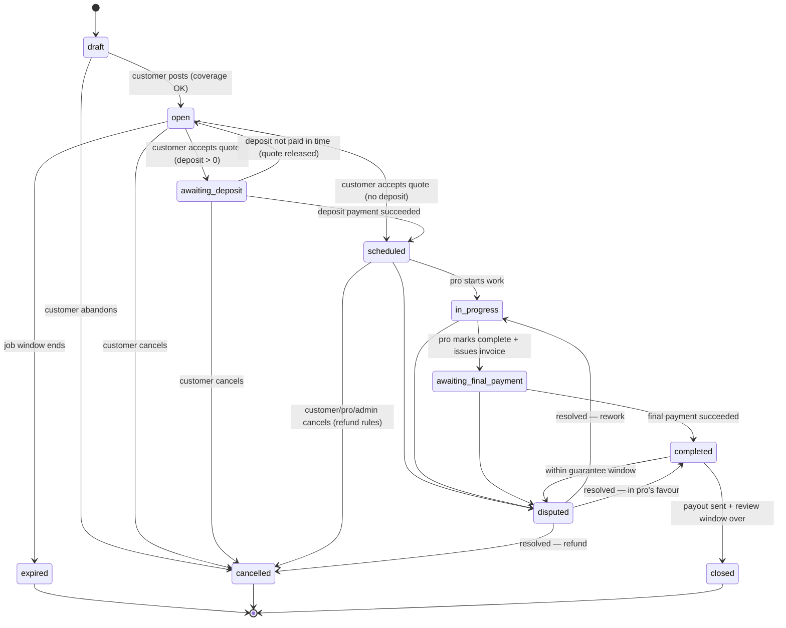

# Job lifecycle (state machine)

> Naming: the customer-facing word is **job**. In code the entity is `ServiceJob` (table `service_jobs`) because Laravel already uses `jobs` / `App\Jobs` for queued work.

The job state machine is the heart of Get Sorted. **All status changes go through one class (`App\Domain\ServiceJobs\ServiceJobStateMachine`) and one action per transition.** Nothing else may write `service_jobs.status`. Every transition writes a row to `service_job_events` (the timeline and audit trail).

## States

| State | Meaning | Customer sees | Pro sees |
|---|---|---|---|
| `draft` | Customer is still scoping | "Finish your request" | Nothing |
| `open` | Posted; invites out; collecting quotes (max 3) | "Finding your pros · 1 of 3 quotes in" | Invite / job card |
| `awaiting_deposit` | Customer accepted a quote that requires a deposit | "Pay deposit to confirm" | "Waiting for deposit" |
| `scheduled` | Booked: deposit paid, or none required | "Booked for Wed 7 Oct, morning" | Job with full address |
| `in_progress` | Pro has started work | "Work in progress" | "Mark complete" |
| `awaiting_final_payment` | Pro marked complete and issued final invoice | "Check the work, then pay" | "Waiting for payment" |
| `completed` | Final invoice paid; customer confirmed or auto-confirmed | "Done · leave a review" | "Payout scheduled" |
| `closed` | Payout sent and review window ended | Archive | Archive |
| `disputed` | Customer or pro raised an issue; payouts frozen | "We're looking into it" | "Under review" |
| `cancelled` | Cancelled by customer, pro (after acceptance) or admin | "Cancelled" | "Cancelled" |
| `expired` | No accepted quote before the job window ended | "No quote accepted — repost?" | Removed |

## Transition rules

| From → To | Who | Guards | Side effects |
|---|---|---|---|
| draft → open | Customer | Phone verified; required scoping answers present; property in launch area; ≥ 1 eligible pro | Create invites (see matching.md); notify pros; WhatsApp "job posted" to customer |
| open → awaiting_deposit / scheduled | Customer | Quote is `submitted`, not expired, belongs to this job | Quote → `accepted`; other quotes → `declined`; reveal address to winning pro; notify all quoting pros |
| open → expired | System (scheduler) | Job window elapsed (default 72 h) and no accepted quote | Notify customer with "repost" link; quotes → `expired` |
| awaiting_deposit → scheduled | System (payment webhook) | Verified provider webhook for the deposit payment | Record ledger entries; notify pro |
| awaiting_deposit → open | System | Deposit unpaid after 48 h | Accepted quote → `released`; customer told |
| scheduled → in_progress | Pro | Today ≥ scheduled date − 1 day | Notify customer |
| in_progress → awaiting_final_payment | Pro | Final invoice issued (amount ≥ 0) | Notify customer; start 72 h auto-confirm timer |
| awaiting_final_payment → completed | System (payment webhook) | Verified webhook; no open dispute | Schedule payout (next business day); open review window (14 days) |
| any active → disputed | Customer, pro, admin | Reason given; within guarantee window for `completed` (default 30 days) | Freeze unpaid payouts; create dispute record; notify admin |
| disputed → * | Admin only | Resolution recorded | Apply refund/payout per resolution; notify both sides |
| * → cancelled | Customer (before `in_progress`), pro (with reason, after acceptance), admin (any time) | Reason required | Apply cancellation/refund rules (money-flow.md); release payouts or refund |
| completed → closed | System | Payout `paid` and review window ended | Archive |

## Child records and their own states

- **Invite** (`service_job_invites`): `invited → viewed → quoted | declined | expired`. Invite expires after 24 h without a quote.
- **Quote** (`quotes`): `draft → submitted → accepted | declined | withdrawn | expired | released`. A pro may revise a submitted quote; the old version becomes `superseded` and the new one is `submitted`. Validity default 7 days.
- **Payment** (`payments`): `pending → succeeded | failed`; `succeeded → refunded | partially_refunded | charged_back`.
- **Payout** (`payouts`): `scheduled → held (dispute) → scheduled`, `scheduled → paid | failed`.

## Timers (all configurable in admin settings, never hard-coded)

| Timer | Default |
|---|---|
| Invite expiry | 24 h |
| Job quote window | 72 h or 3 quotes, whichever first |
| Quote validity | 7 days |
| Deposit payment window | 48 h |
| Auto-confirm completion | 72 h after pro marks complete, if no dispute |
| Review window | 14 days |
| Guarantee / dispute window after completion | 30 days |
| Payout | next business day after `completed` |

## Implementation notes for the AI

- Status is a PHP backed enum `ServiceJobStatus`. Allowed transitions live in **one** map in `ServiceJobStateMachine`; tests iterate that map.
- Each transition is an Action class, e.g. `AcceptQuote`, `MarkServiceJobComplete`, wrapped in a DB transaction with a row lock on the job (`lockForUpdate`).
- Timers run as scheduled commands or delayed queued jobs that **re-check state before acting** (idempotent).
- Every transition must have a Pest test for the happy path and for each guard failing.
